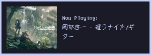

# mpd-notify
Provides song covers to notify based on currently playing track in mpd.

## Usage
You can set the script to execute on song change, for example in ncmpcpp config with the option: ´execute_on_song_change="/path/to/script/´, or you can use other software such as [mpd_trigger.](https://github.com/Determinant/mpd_trigger)

## Example (yes, my font is bad, no, I wont fix it)

  

